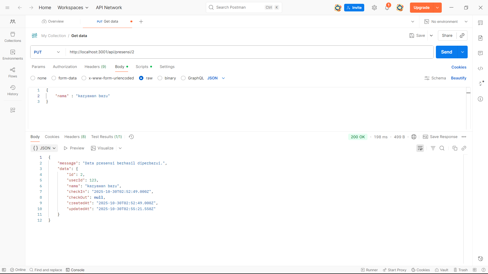
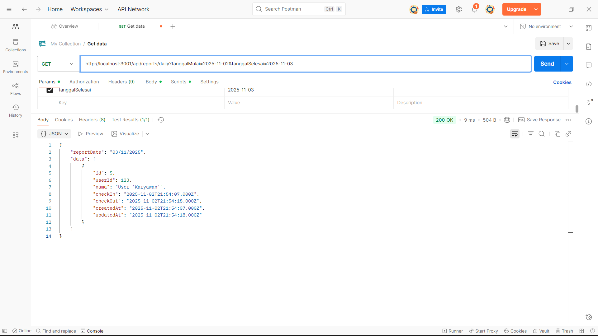

# Tugas 5 - Melengkapi RESTful API (Update, Delete, Search) dengan Sequelize

*Nama:* Hanun Nisa Salsabila
*NIM:* 20230140130 
*Kelas:* C  

---

## Screenshots Hasil Praktikum

### 1. PUT (Endpoint Update Data Presensi)

### 2. PUT (Endpoint Update Jika Format Tanggal yang Diisi Valid)

### 3. PUT (Endpoint Update Jika Format Tanggal yang Diisi Tidak Valid)

### 4. DELETE (Endpoint Delete Data)

### 5. GET (Enpoint Search Berdasarkan Nama)

### 6. GET (Endpoint Search Berdasarkan Tanggal)
