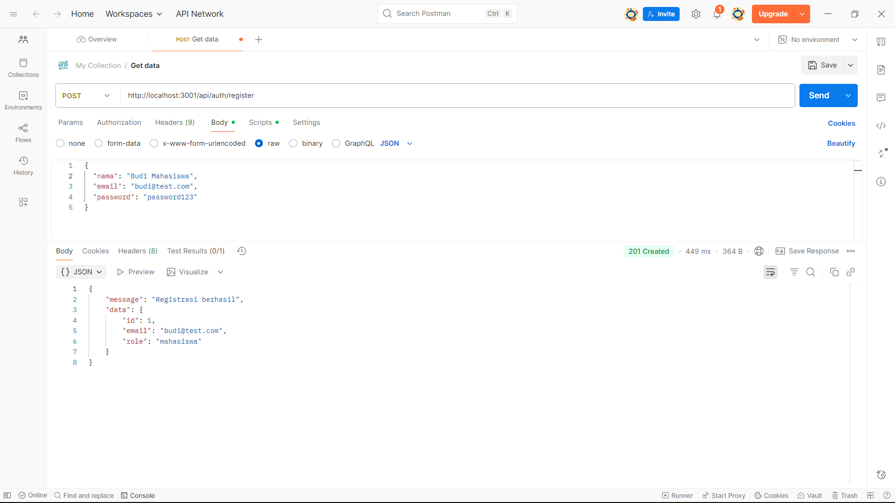
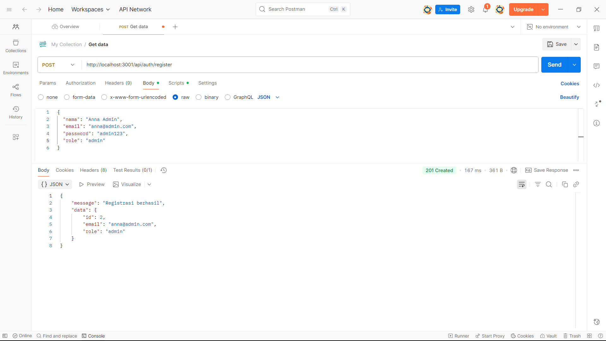
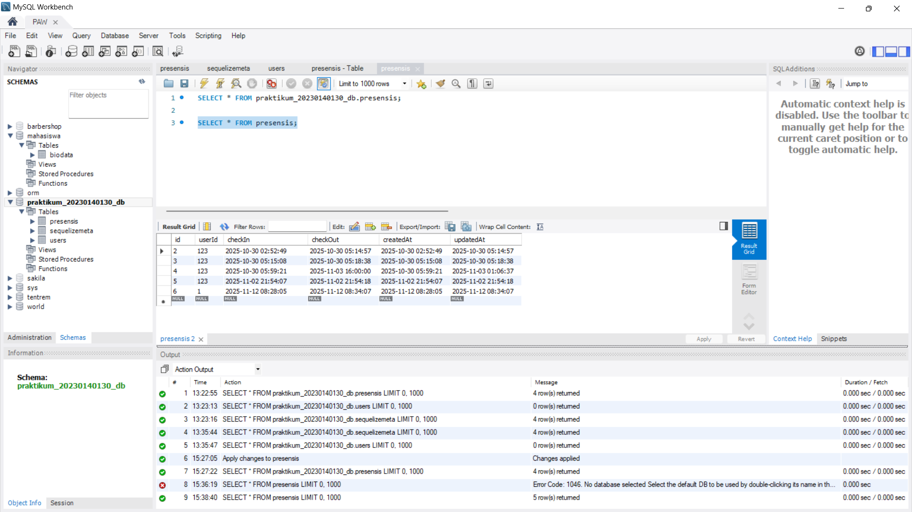

# Tugas 6 - Autentikasi API dengan JWT, Bcrypt, dan Role User

*Nama:* Hanun Nisa Salsabila
*NIM:* 20230140130 
*Kelas:* C  

---

## Screenshots Hasil Praktikum

### 1. POST (Register User "Mahasiswa")

### 2. POST (Register User "Admin")

### 3. POST (Login (Mahasiswa) & Dapatkan Token)
_dan_Dapatkan_Token.png)

### 4. POST (Check-in (Menggunakan Token))
.png)

### 5. PUT (Check-in (Menggunakan Token))
.png)

### 6. MySQL (Check Database)
