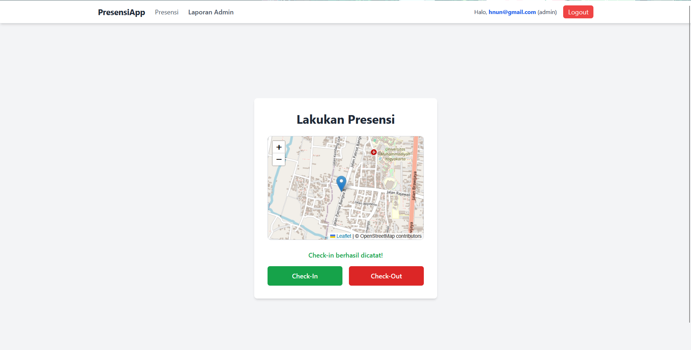
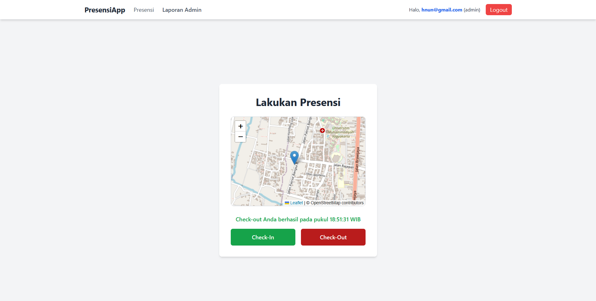
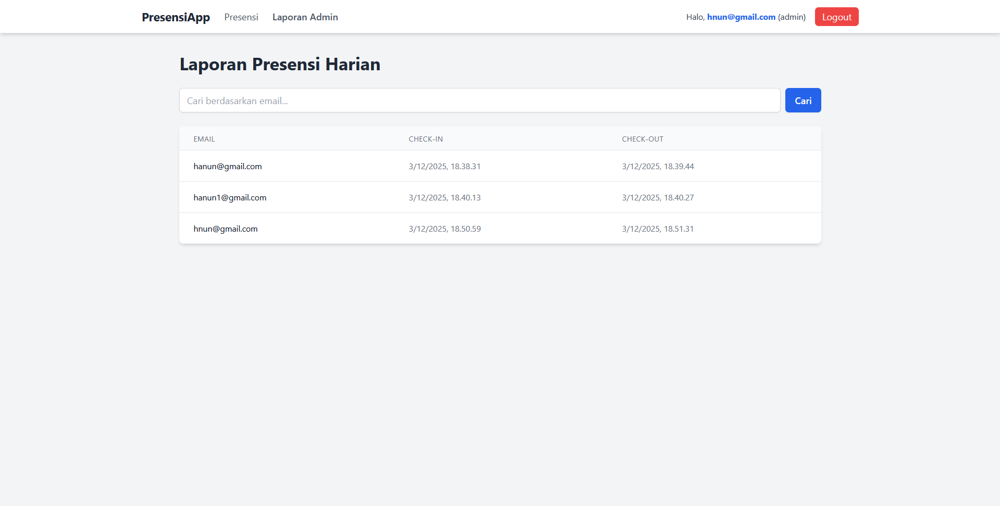
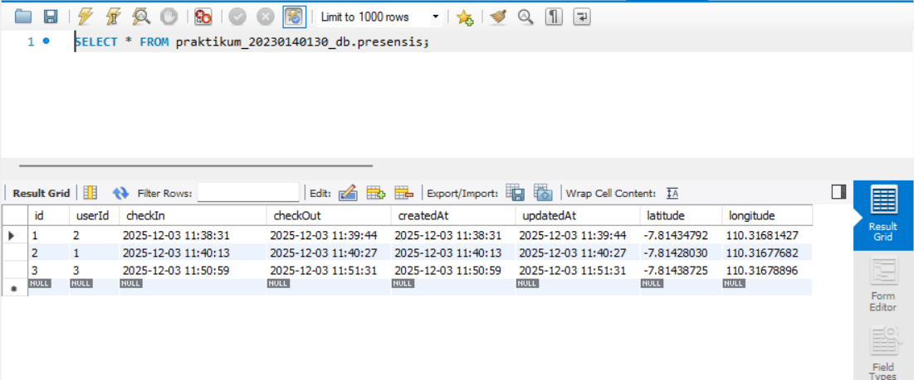

# Tugas 8 - Integrasi Final Full-Stack, Relasi Database, dan Geolocation

*Nama:* Hanun Nisa Salsabila
*NIM:* 20230140130 
*Kelas:* C  

---

## Screenshots Hasil Praktikum

### 1. EndPoint Presensi Check-in

### 2. EndPoint Presensi Check-out

### 3. Tampilan halaman presensi dengan menampilkan maps OSM (Check-in)
.png)

### 4. Tampilan halaman presensi dengan menampilkan maps OSM (Check-out)
.png)

### 5. Tampilan halaman report yang berisi data presensi dari semua user

### 6. Screenshote tabel presensi di database
